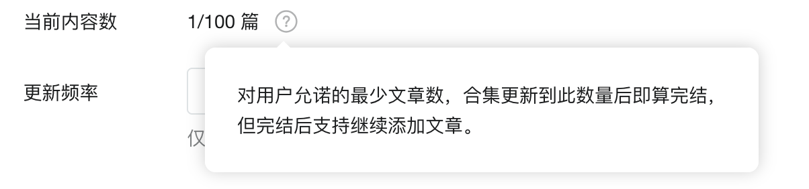
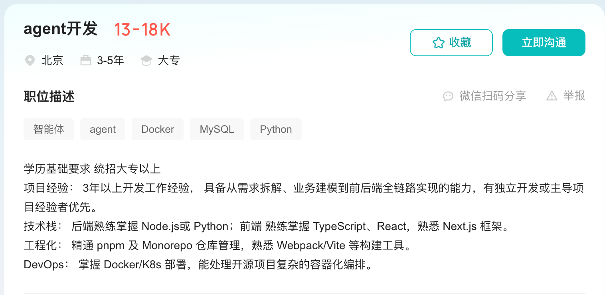
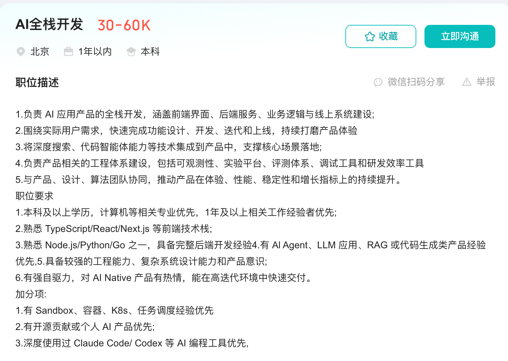
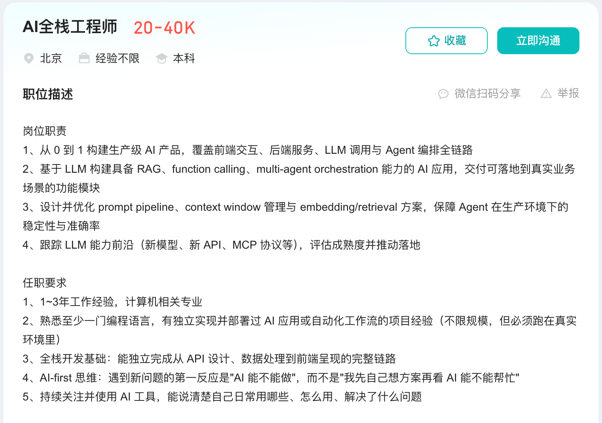
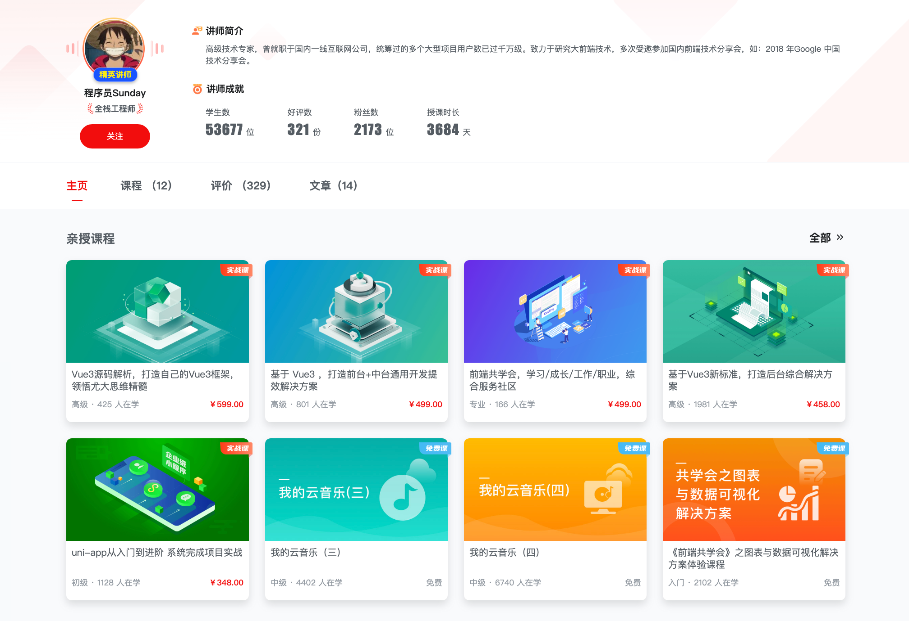
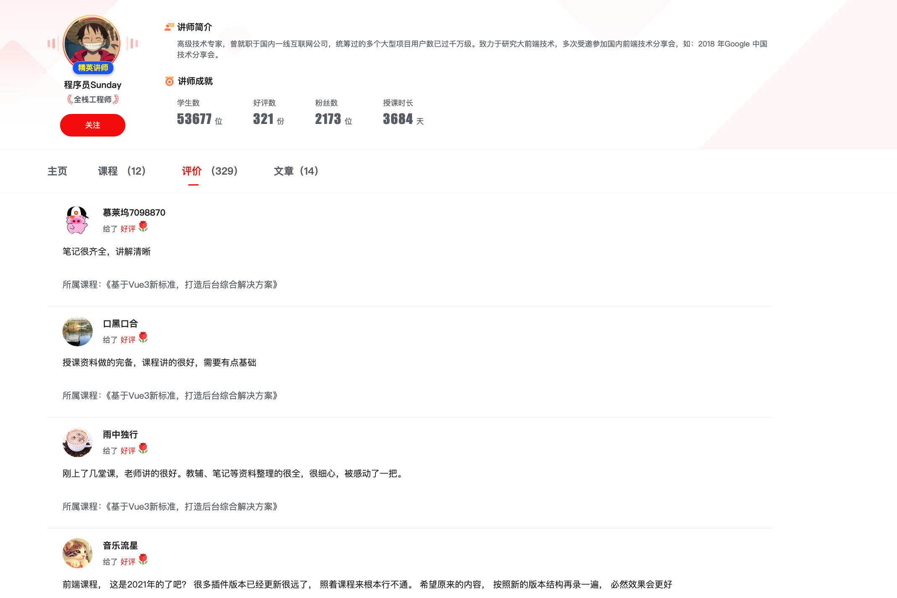

# 全新的 AI 全栈课程大纲

前段时间，我做过一套 [《AI 全栈课程（面试汪）》课程](https://mp.weixin.qq.com/s/ak625tfAU_JUT6G_MC6n4Q)。

那套课程围绕真实上线的“面试汪”项目展开，使用 NestJS、LangChain 等技术，带着大家完成一套商业级 AI 全栈应用。

他的核心是：**一个前端开发者，应该如何补齐全栈能力，并且把大模型真正接入到一套真实商用的产品中。**

但是，随着课程内容不断更新，我发现又出现了一个新的问题。

那就是 **哪怕这个项目本身再复杂，他依然无法涉及到所有 Agent 的知识**。依然会有知识的遗漏，这是我不想看到的。

比如：Agent 如何规划任务？多个 Agent 如何互通交互？RAG 的完整存储、召回体系？等等的。

并且，这些内容很难通过几节的加餐完整讲清楚。

所以，我准备单独做一套 **《Agent 全栈实战课》**。

我希望这套课程 **可以覆盖近乎所有的Agent 全栈知识**

所以，我在这里一下子给它设计了 **100 个小节**。不是固定 100，而是最少 100。。。

就是希望大家看完这一套课程之后，可以彻底、完全掌握所有的 Agent 知识！

感觉猛猛的。。。

> PS：目前课程的第一小节已经上线了，[大家可以直接点击这里查看。第一小节是完全免费的（可以免费阅读 99%）](https://mp.weixin.qq.com/s/Ule7xfE7PBWi5hURNC1feQ)

## 新课程和《AI 全栈课程（面试汪）》有什么区别

两套课程会解决的是不同阶段的问题。

- 《前端转 AI 全栈》以“面试汪”商业项目为主线。大家会跟着一个完整产品，学习前端、服务端、AI 能力和商业业务如何组合起来。它更适合希望从前端走向 AI 全栈，并且需要一套完整项目经验的同学。
  
- 《Agent 全栈实战课》则以 Agent 知识体系为主线。同时该课程我会把它放到 「Sunday 的程序员客栈中」，通过公众号付费合集的形式完成
  

它不会只围绕一个业务项目讲解，而是把大语言模型、Tool Calling、MCP、RAG、Memory、LangGraph、Multi-Agent、Evaluation、Security 和生产治理等内容分别拆开来讲

目前第一小节已经完成了，大家点击这里可以直达：[第一章：01 - 从聊天机器人开始认识大语言模型已付费](https://mp.weixin.qq.com/s/Ule7xfE7PBWi5hURNC1feQ?payreadticket=HK1zuXw8Ux5JoktTJ-S4hc18JNI1DFvn0Q_-v9wNusdsD-SoolJRWJ6H_Z9zyNR4yhtAldk)

在这套课程中，我会让每个大章专门解决一类问题，并完成一个对应项目。最后，再把这些能力组合成一套生产级 Agent 系统。

可以简单理解为：

| 课程                  | 主要解决的问题                                   | 学习主线                    |
| --------------------- | ------------------------------------------------ | --------------------------- |
| AI 全栈课程（面试汪） | 如何完成一套真实商业级 AI 全栈产品               | 围绕“面试汪”完整项目学习    |
| 新课程                | 每个大章都会构建一套知识体系，从而系统掌握 Agent | 围绕 Agent 核心能力逐章深入 |

两套课程可以互补，从而拥有深入 Agent 的能力

## 这套课程会怎么讲

整套课程暂时划分为 **六个部分、三十三个大章，以及两个进阶专题**。

每个大章只重点讲解一类 Agent 能力。

例如：学习 RAG 时，不会一上来就连接向量数据库、复制一大段框架代码。我们会先用内存数据完成最小 RAG，观察 Embedding 与相似度检索解决了什么问题，再逐步加入文档分块、向量数据库、混合检索、Rerank 和检索评估。

学习 Agent 的时候也是一样的。

大部分章节都会按照下面这条路径推进：

## 目前的大章划分

先给大家看看目前的大章设计，内容嗷嗷多（`PS：` 每个大章下大概会有 8 ～ 12 个小节，大家可以自己算算一共会有多少内容。）

可以说是我迄今为止做的最大的最完善的 Agent 全栈课程了

**第一部分：大模型与 Agent 基础**

- 第一章：大语言模型与 AI 应用基础
- 第二章：模型 API、消息协议与流式响应
- 第三章：结构化输出、Schema 与结果校验
- 第四章：Agent 原理、组成与能力边界
- 第五章：Agent Loop、Reasoning 与任务规划

**第二部分：Node.js Agent 框架与工程方法**

- 第六章：Node.js AI 框架选型与能力对比
- 第七章：LangChain 核心能力与生态详解
- 第八章：Prompt、Context 与 Harness Engineering
- 第九章：Tool Calling 与 Tool Engineering
- 第十章：MCP 原理、能力连接与安全边界

**第三部分：知识检索与 Agent Memory**

- 第十一章：RAG 原理、Embedding 与向量检索
- 第十二章：文档解析、分块与向量数据库
- 第十三章：高级 Retrieval、混合检索与 Rerank
- 第十四章：Agentic RAG 与 GraphRAG
- 第十五章：短期记忆、会话状态与上下文压缩
- 第十六章：长期记忆、记忆检索与遗忘机制

**第四部分：Agent 工作流与复杂任务**

- 第十七章：Agent State、Runtime 与 Durable Execution
- 第十八章：Workflow、LangGraph 与状态编排
- 第十九章：Human-in-the-loop 与 Agent 可控性
- 第二十章：Deep Research 与证据工程
- 第二十一章：Browser、Code 与 Computer Use Agent
- 第二十二章：Subagents、Multi-Agent 与 Deep Agents
- 第二十三章：Agent Skills 与可复用能力封装

**第五部分：Agent 产品形态与交互能力**

- 第二十四章：Agent 事件流、SSE 与前后端状态同步
- 第二十五章：Agent UX、Generative UI 与交互协议
- 第二十六章：实时语音 Agent
- 第二十七章：数据分析 Agent 与 Text-to-SQL
- 第二十八章：文档智能与多模态 Agent

**第六部分：生产级 Agent 工程**

- 第二十九章：Agent Security、权限与能力隔离
- 第三十章：Agent Evaluation 与 Trace Grading
- 第三十一章：Agent Observability、可靠性与成本治理
- 第三十二章：Agent 持续改进与版本治理
- 第三十三章：生产级 Agent 系统综合实战

**进阶专题**

- 进阶专题一：开放 Agent 协议栈
- 进阶专题二：模型策略、微调与私有化部署

> PS：以上大章设计后续可能会有一些微调。这是正常的

## 可以收获什么？

如果说最大的收获，那么我觉得一句话就可以说清楚，那就是：**你将具备面试 Agent 全栈岗位的技术能力！**

### 你会掌握 Agent 开发的完整流程与核心概念。

包含：`Agent Loop、Reasoning、任务规划、Prompt + Context + Harness Engineering、Tool Calling、MCP、RAG、Embedding、向量检索、混合检索、Rerank、GraphRAG、短期记忆、长期记忆、LangGraph、Durable Execution、Human-in-the-loop、Deep Research、Browser Agent、Multi-Agent、Agent Skills、Evaluation、Observability、Security、成本治理` 等等等等 的数十个 Agent 核心概念

### 你会完成 10 余个 Agent 项目

这些项目会覆盖知识库问答、Tool Calling、MCP、长期记忆、Agent 工作流、Deep Research、Browser Agent、Multi-Agent、数据分析 Agent、文档智能，以及最终的生产级 Agent 综合项目 等等。

### 你会拥有可以写进简历、也能够在面试中讲清楚的 Agent 项目经验

你能够讲清楚：

- 为什么这个需求需要 Agent，而不是普通工作流
- RAG 的文档如何分块，召回效果如何评估
- Agent 为什么选择这个工具，调用失败以后如何处理
- 长任务为什么需要状态持久化和失败恢复
- 如何限制 Agent 的权限，避免危险操作
- 如何观察质量、延迟和成本，并持续优化系统
- 等等等等。。。。

## 学了就能拿到 offer 吗？

不敢承诺这个事情。

**课程不能替任何人保证 Offer，也不能保证学完立刻涨薪。**

就业和薪资还会受到工作年限、基础能力、所在城市、表达能力与市场环境影响。

但是，我能承诺的是 **这套课程你学完之后，至少可以全面的、完整的了解 Agent 大模型的知识**。

给大家看看现在 AI 全栈的薪资（AI 全栈、Agent 开发）：

一个大专的，一个本科的。不多列了，大家也可以自己到 BOSS 上搜一下看看。

并且，咱们仔细看上面 JD 上的技能要求：

- “从 0 到 1 构建生产级 AI 产品，覆盖前端、后端、LLM 调用与 Agent 编排” —— **课程会使用 Node.js 与 NestJS，带大家完成从模型接入、Agent 服务到前端交互的完整开发链路！**
- “具备 RAG、Function Calling、Multi-Agent Orchestration 能力” —— **RAG、Tool Calling 与 Multi-Agent 都会作为独立大章讲解，并分别完成可以运行的实战项目！**
- “设计并优化 Prompt Pipeline、Context Window 与 Embedding/Retrieval 方案” —— **课程不只讲 Prompt，还会深入 Context Engineering、Harness Engineering、上下文压缩、向量检索、混合检索与 Rerank！**
- “保障 Agent 在生产环境下的稳定性与准确率” —— **课程专门覆盖 Agent Evaluation、Trace Grading、可观测性、安全、成本治理、故障恢复与持续改进！**
- “跟踪新模型、新 API 与 MCP 等能力并推动落地” —— **MCP、LangChain、LangGraph、Deep Agents、Agent Skills 与开放 Agent 协议都会系统讲解！**
- “能够独立完成 API、数据处理到前端呈现的完整链路” —— **这正是 Agent 全栈课程的最终目标：不只会调用模型，而是能够独立设计、开发并交付一套完整 Agent 产品。**

当然了，这是一家 JD 的举例。

不过大家可以任意去看目前的 BOSS 上的招聘信息，你就看那些高薪资的 Agent 开发岗位所需要的 Agent 技能。

有一个算一个，咱们后续都会更新上～

## 有课程评价吗？

说实话这个课程因为是新上的，还真没什么评价系统。

不过，Sunday 之前在慕课网录制过不少的技术课程，大家可以参考对应的评价系统：

## 哪些同学适合学习

- **希望增加项目亮点的校招与应届生**：这套课程会通过多个 Agent 项目，帮助你真正理解并实现 RAG、Tool Calling、MCP、Memory、Multi-Agent 和 Evaluation。面试时不只能够展示项目，也能够解释项目背后的原理与设计。
- **AI 焦虑的程序员**： 这个课程可以帮你解决几乎所有的 AI 焦虑问题。AI 时代已经确定来了。就业市场几乎所有的岗位都需要有 AI Agent 的能力，无论这个岗位是否用得到
- **希望进入 AI 应用与 Agent 开发岗位的同学**：AI Agent 岗位现在是有溢价的，大大的溢价。大家可以看最近两个月训练营的就业数据，全部都需要和 Agent 全栈挂钩。

> PS：
>
> - Agent 岗位不需要很高的学历，对学历的要求和之前的前后端没有什么本质的区别。
> - 这个课程的学习也不需要很深的技术储备，有 JS 或 TS 的能力即可

## 购买前常见问题

### 只有前端或者 java 经验，可以学习吗？

可以。

课程主要会围绕着 Agent 的知识进行讲解。NodeJS 相关只是一个知识 “载体”

### 课程会不会只是介绍大量概念？

不会。

每个大章都会围绕一类问题展开，并配合可以运行的案例或项目。课程会解释概念，但最终会把概念落实到代码、运行结果和工程中。

### 会提供完整源码吗？

会的。

### 课程的更新节奏

一周更新 1 ～ 3 篇。主要看不同小节的难度

## 最后

Agent 全栈包含的内容很多。

但是，学习路线并不需要从复杂的 Multi-Agent 或生产架构开始。

我们会先从一个熟悉的聊天机器人出发，观察大语言模型到底做了什么。然后逐步给模型增加知识、工具、记忆、工作流和运行环境，直到它能够可靠地完成真实任务。

框架和模型还会继续变化。

真正有价值的，不是记住今天某个 API 的写法，而是理解 Agent 系统面对的问题，并且能够使用当前合适的技术把问题解决。

下一篇，咱们正式开始第一章：

[从聊天机器人开始认识大语言模型](https://mp.weixin.qq.com/s/Ule7xfE7PBWi5hURNC1feQ)
