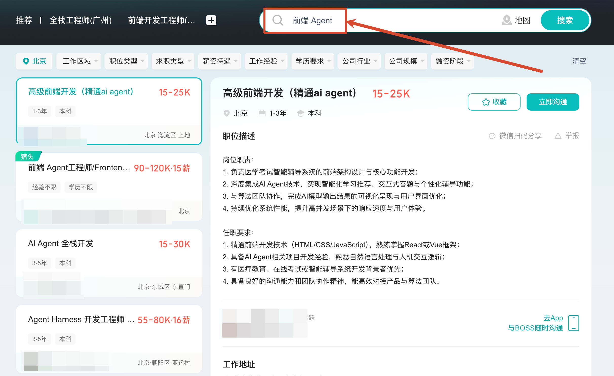
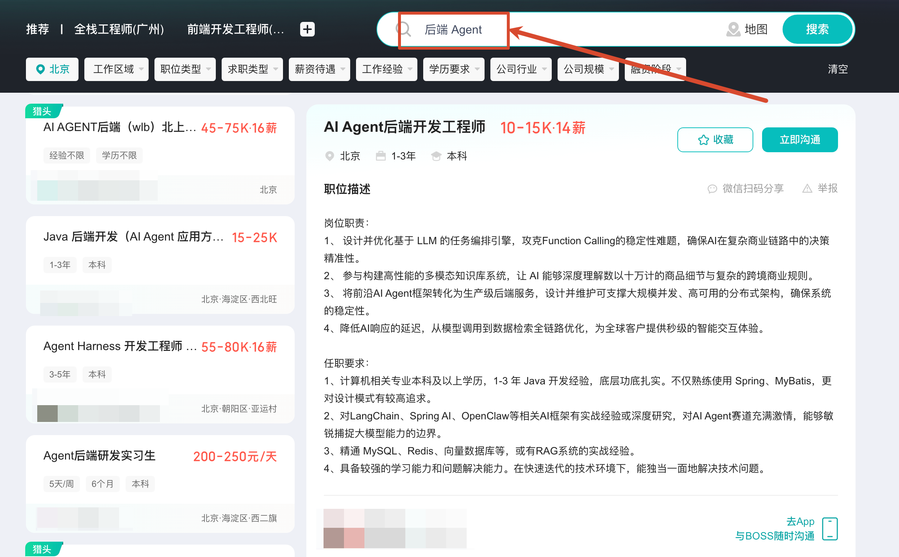
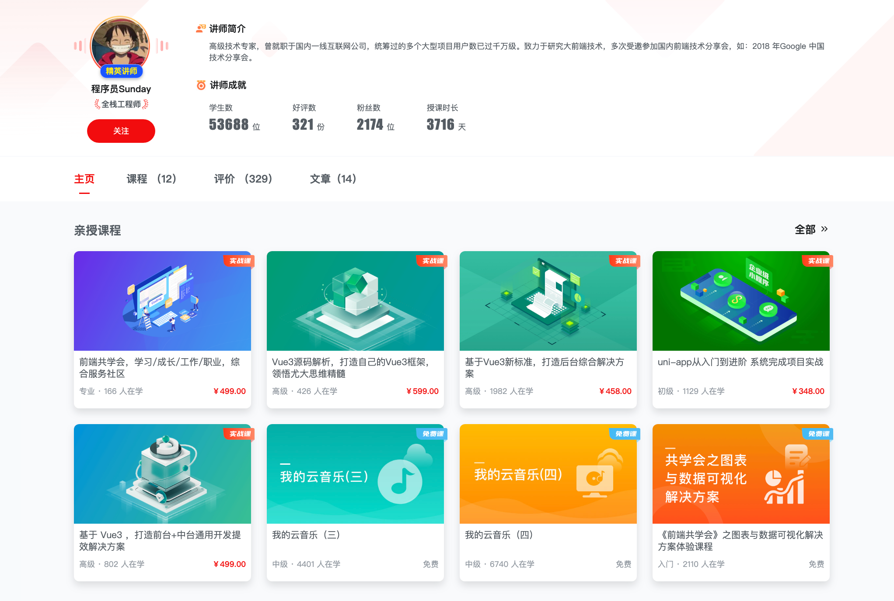
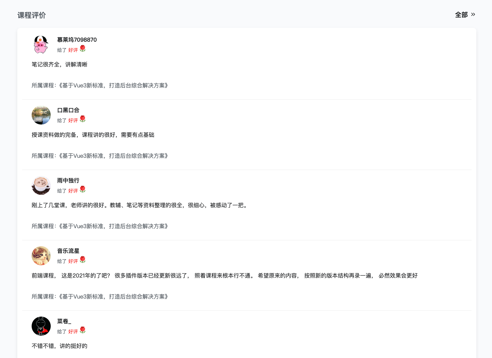

大家好，我是 Sunday。

AI 时代，很多同学应该都在学习各种各样的 Agent 知识。

目前市面上的 Agent 课程也有很多，但是总缺少一个 **《0 ～ 1 的系统课》**

很多课程的知识比较零碎，单一的 RAG 原理、或者零碎的 MCP 方案、或者只是教你完成一次 大模型 API 的调用

很多同学学了一圈以后会发现：**哪怕我完成了大模型 API 的调用，甚至跟着完成了一个项目，但是自己好像依然不了解 Agent**

这也正是我制作这套《Agent 大模型 0～1 系统课》的原因。

整个课程不依赖某一个模型、也不依赖某一个框架的 Agent 开发方法。而是想要 **慢慢的，有规划，成体系的，帮大家完成整个 Agent 的系统学习**

课程会提供 `NodeJS + Python` 两种语言的代码，并会使用 **视频 + 文字** 两种混合的讲解方式来完成。具体可以参考 [前置必读：Node + Python 双版本](https://mp.weixin.qq.com/s/293JkSkMWYLZT2THFX9Qjg?payreadticket=HIYYgBBmW0mtusmnmlrck93kNt8FReIemQ9PlesdrfD4Mn2o79jUsC9MZPhdIS_hjMucQvA)

整套课程目前规划了 11 个大章、100 多个小节。

看着好像还蛮多的，但是 **课程的价值从来不在于章节多**。而是大家学完之后是否可以真的认为：**我已经彻底入门了 AI Agent 开发了**。再面试 Agent 岗位，我也不虚了～

能达到这个目的就够了。

因此，咱们会先从：

- 大模型为什么能够生成内容开始，先理解模型的能力和边界
- 当模型不知道企业资料时，引出 RAG 和知识库
- 当模型无法操作外部系统时，引出 Tool Calling 和 MCP
- 当一次简单的工具调用无法完成复杂任务时，再手写 Agent Loop，理解 Agent 是怎么围绕目标不断选择行动的。

然后，咱们会继续解决 Agent 在真实项目里一定会遇到的问题：

- 怎样保存长期记忆
- 怎样压缩越来越长的上下文
- 怎样让任务在中断以后继续执行
- 怎样在退款等高风险操作前加入人工审批
- 怎样把复杂任务拆给 Skill 或 Subagent
- 以及怎么跟踪 Agent 的执行轨迹，定位 Agent 在哪里出现问题

最后，咱们会把这些能力组合到一个完整的 Agent 项目里面。

- 如果你想要 0 ～ 1 系统的学习  AI Agent 体系 
- 如果你已经会调用模型 API，但是不知道下一步应该学什么
- 如果你看过很多 RAG、MCP 和 Agent 教程，却始终没有形成完整的知识体系
- 或者你希望真正完成一个有业务流程、有工程深度，也能够写进简历的 Agent 项目

那么，这套课程就是为你准备的。

那么接下来，咱们就从第一大章开始，带大家快速看完整套课程的学习路线：

### 第一章：大语言模型与 AI 应用基础

所有 Agent 能力，底层都建立在大语言模型之上。

如果不了解模型如何接收信息、生成答案以及产生幻觉，后面学习 RAG、Tool Calling 和 Agent Loop 时，就很难深度理解了。

所以，第一章会从 AI 聊天机器人开始，通过实验讲清 `Token、Message、Context、模型幻觉、模型分类以及 Transformer` 等基础知识。

学完以后，大家应该能够看懂一次模型调用究竟发生了什么，也能够判断大模型适合做什么、不适合做什么。

### 第二章：RAG 原理、向量数据库、混合检索与 Rerank

大模型并不知道企业内部的产品文档、业务规则和私有数据。

那么想让模型基于这些资料回答问题，就需要为它建立一套可靠的知识检索系统。

这一章会从最简单的文档检索开始，逐步讲清 `文档解析、分块、Embedding、向量数据库、混合检索、Rerank、问题改写、来源引用和拒答机制`。

最后，咱们会直接实现一个具备完善功能的企业知识库。

### 第三章：MCP 原理、Tool Calling 与能力连接

模型可以理解用户想做什么，却不能直接查询订单、读取数据库或者调用退款接口。

所以，这一章咱们会先通过原生 Tool Calling，理解模型如何提出工具调用请求，以及应用程序如何执行真实操作。

然后再引出 MCP，完成 MCP Server、Client 和 Host 的完整调用链，并讲清协议原理、通信方式与安全边界。

### 第四章：Agent 原理、运行循环与能力工程

模型能够调用一次工具，并不代表它已经成为了 Agent。

这一章咱们不依赖 Agent 框架，直接手写一个完整的 Agent Loop，让模型能够判断下一步、选择工具、读取结果、继续执行或者结束任务。

咱们还会学习任务规划、Routing、Reflection、终止策略和 Tool Engineering。

学完之后，大家应该就可以彻底理解 Agent 是怎么运行的，并完成一个支持任务规划、工具执行与结果校验的业务 Agent。

### 第五章：LangChain 核心能力、运行原理与源码解析

理解 Agent 的运行原理以后，咱们再来看框架到底帮我们做了什么。

这一章，咱们得对比不同的 Agent 开发方案，并使用 LangChain 重新实现前面手写的 Agent。

除了学习框架用法，咱们还会追踪 `LangChain` 的核心源码调用链，理解它与 `LangGraph、Deep Agents 和 LangSmith` 之间的关系。

现在的面试中，已经有些大厂开始追问源码的知识了。

那么这一章学完之后，大家不仅能够使用 LangChain 开发 Agent，、还能理解框架内部源码是如何组织模型、工具和运行状态的。

### 第六章：Agent Memory、会话恢复与 Agentic RAG

知识库可以让 Agent 了解企业资料，却不能让它真正“记住”用户。

所以，这一章咱们会讲：**对话历史、会话状态、长期记忆和企业知识库之间的区别，并实现状态持久化、上下文压缩、记忆提取、更新、召回与删除**。

最后，再让 Agent 根据任务自主选择应该读取对话、长期记忆还是企业知识库。

然后，咱们还得完成一个能够恢复会话、保存用户记忆并自主选择信息来源的 **个性化知识客服 Agent**。

### 第七章：LangGraph、持久化执行与 Human-in-the-loop

真实业务任务不一定能够在一次请求中完成。

退款审核、资料补充和人工审批，都可能让任务暂停几个小时，甚至几天。服务重启以后，系统还需要知道任务执行到了哪里。

所以，这一章咱们得使用 `LangGraph 实现状态管理`、断点恢复、暂停、继续、失败重试、任务回放和人工审批，并解决重复执行工具可能带来的业务风险。

### 第八章：复杂任务 Agent、Skills 与多 Agent 协作

当任务变得足够复杂，一个 Agent 很容易遇到上下文膨胀、步骤混乱和结果缺少证据等问题。

这一章我想着咱们以企业调研任务为主线，`学习任务拆解、多轮搜索、来源验证、Workspace、Skills 和 Subagent，并理解 Router、Supervisor、Reviewer 与 Handoff 等多 Agent 协作方式`。

最后，再实现一个能够规划任务、管理中间资料、委托 Subagent 并生成可信报告的企业调研 Agent。

### 第九章：多模态 Agent：图片、语音与业务数据分析

真实业务中的信息不只有文字，还可能来自商品照片、扫描件、语音、Excel、CSV 和数据库。

这一章会学习如何根据输入类型选择视觉模型、OCR、ASR、SQL 或代码执行工具，并把不同处理结果交给 Agent 继续分析和验证。

最后完成一个能够识别图片、理解语音、分析业务数据并自主选择处理路线的多模态 Agent。

### 第十章：Agent Evaluation、执行轨迹与安全边界

日常开发有测试和监控，Agent 开发更要有。

这一章会从最终答案、工具选择、调用参数和执行步骤等多个角度评估 Agent，并通过测试数据集、Trace、人工评估和 LLM-as-a-Judge 建立自动化评估与回归测试。

同时，咱们还会补齐 Prompt Injection、工具权限、敏感操作审批和 Guardrails 等安全能力。

### 第十一章：综合实战——企业业务 Agent 系统

最后，咱们得把前面所有学到的知识，融合起来，完成一个完整的企业业务 Agent。

目前优先考虑的是企业售后场景。因为这个场景可以同时覆盖知识库问答、订单查询、工具调用、长期记忆、人工审批、多模态材料处理和自动化评估。

最终的业务方案可能还会调整，但是目标不变。

无论最后选择哪个场景，咱们都会走完需求分析、系统设计、开发、调试和评估的完整过程。

## Node.js、Python，咱们都提供

考虑到不同同学的技术背景不同，这套课程会提供 `Node.js + Python` 两套相互独立的代码。

- 熟悉前端和 TypeScript 的同学，可以直接选择 Node.js 版本
- 平时使用 Python，或者希望学习 Python 的同学，可以看 Python 版本

两套代码解决的是同一个 Agent 问题，承担相同的课程职责。

同时，课程会采用视频和文字结合的方式。

- 视频负责带着大家理解、操作和观察结果
- 文字课程则会保留完整代码、操作步骤、运行验证和问题说明，方便后面反复查阅。

## 说了这么多，这套课程到底值不值得学

11 个大章、100 多个小节，看起来确实很多。

但是，说实话哈，课程内容多，也并不能直接证明课程有价值。

网上几百个小时的视频课程多了去了。

最后真正重要的，还是大家能不能学懂、能不能在学完以后能不能把这些知识串起来。

所以，我更希望这套课程能给大家提供一个 **完整的 Agent 知识地图**

大家不仅要知道每一项 Agent 技术方案怎么使用，还要知道它为什么出现、解决什么问题、和前后知识有什么关系，以及在真实项目中应该怎么选择。

## 学完之后能干嘛？

说白了就是 **Agent 全栈应用开发工程师**。

这个应该不用我多说了吧，目前就业没有 Agent 的知识是非常难的。

给大家看两个 boss 上的招聘信息：

都是现搜的，同时 JD 中所涉及到的技术栈大家可以随便和咱们前面的课程内容对比。

## 有课程评价吗？

说实话公众号里面也没有评价系统。不过大家倒是可以看课程文章中的评论。

另外，Sunday 之前在慕课网录制过不少的技术课程，大家可以参考对应的评价系统：

## 课程适合哪些同学？

### ✅ 如果你属于下面几种情况，这套课程会比较适合你

- **具备开发基础，但是不了解 AI 的同学**：课程会从大语言模型基础开始，不要求提前掌握复杂的 AI 算法。你只需要选择自己熟悉的 Node.js 或 Python 版本学习。
- **学过 RAG、MCP 和 Agent，却始终没有形成体系的同学**：如果你已经认识很多 AI 名词，但不知道它们分别解决什么问题、应该怎样组合，这套课程会帮你重新建立一张完整的 Agent 知识地图。
- **会调用模型 API，却只能完成简单 Demo 的开发者**：课程不会停留在聊天接口和工具调用，而是会继续学习知识库、长期记忆、任务持久化、人工审批、多 Agent 协作与自动化评估。
- **希望完成一个完整 Agent 项目的同学**：如果你不满足于复制几个示例，而是希望真正走完需求分析、技术选型、开发、调试和评估的完整过程，那么这套课程会比较适合你。
- **正在准备 AI 应用或 Agent 相关面试的同学**：课程不能保证大家一定拿到 Offer，但可以帮助你建立更完整的知识体系，并完成一个自己能够讲清楚设计思路与技术取舍的项目。

### ❌ 下面几类同学需要谨慎考虑

- **完全没有编程基础的同学**：这不是一套编程入门课。课程会提供 Node.js 和 Python 两个版本，但默认大家至少掌握其中一门语言的基础语法和开发方式。
- **想学习模型训练和算法研究的同学**：这套课程的重点是 AI 应用与 Agent 工程，不会深入讲解预训练、模型微调、数学推导和底层算力优化。

## 如何报名

报名方式有两种：

1. 直接在 [文章合集里点击「购买合集」](https://mp.weixin.qq.com/mp/appmsgalbum?__biz=MzcwNjM0Njk2Mg==&action=getalbum&album_id=4577991920081321990#wechat_redirect) 即可：通过这种方式后续直接在 **公众号** 进行学习
2. 私聊我 +V：`sunday9189`：不喜欢公众号阅读的，可以加我购买。通过 **语雀** 进行学习

最后：**祝愿所有同学都能拿到满意的 offer！！！**
